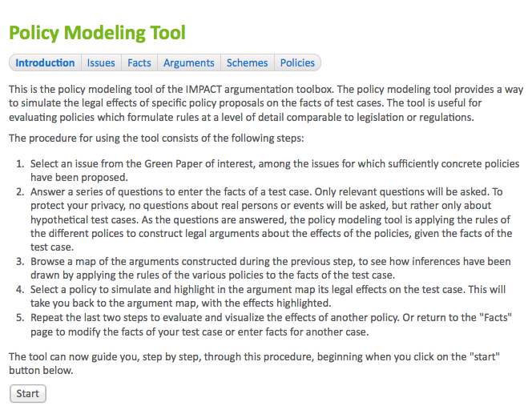
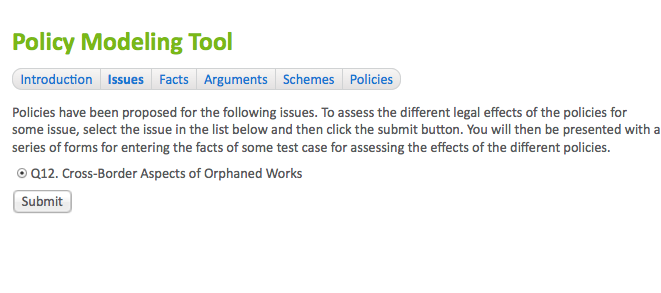
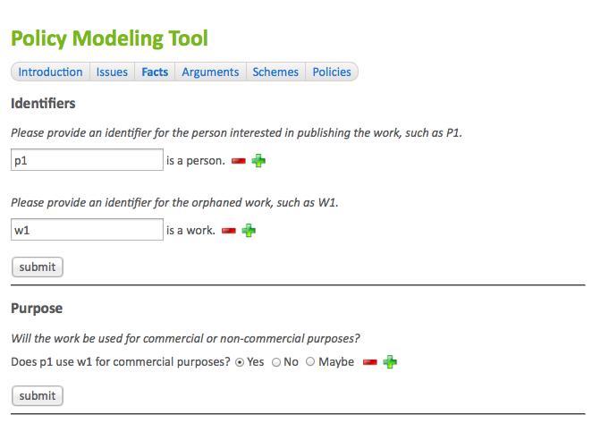
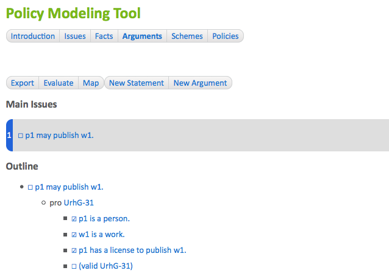
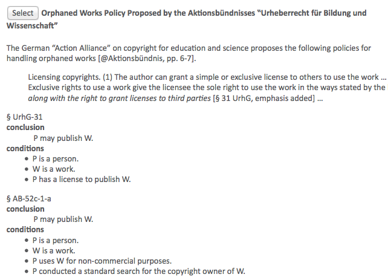
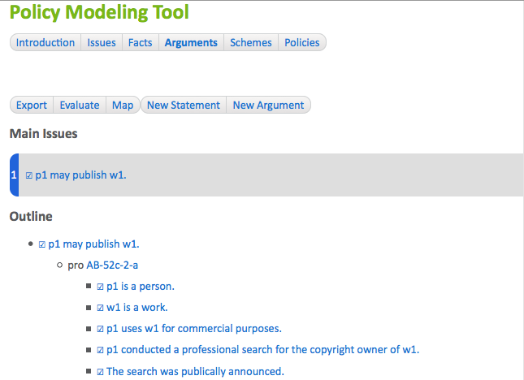

# Analysing and Comparing Policies

The Carneades argumentation system provides a tool to analyze the legal effects of specific policies on the facts of cases. The tool is useful for evaluating and comparing policies which formulate rules at a level of detail comparable to legislation or regulations.

To access the tool, click on the "policy analysis" item in the main menu of the system, shown on every page.  This will take you to introduction page of the tool, which briefly explains the purpose of the tool and the following steps for using it.  

1. Select an issue of interest.
2. Answer a series of questions to enter the facts of a case.
3. View an argument graph automatically constructed by the system by applying the alternative policy models to the facts of the case.
4. Select a policy to evaluate. This will take you back to the argument graph, with the effects of the selected policy highlighted.
5. Repeat the last two steps to try another policy. 

After reading the instructions on the first page, click on the "start" button at the bottom of the page to begin.  This will take you to the "issues" page.

## Selecting an Issue to Analyse

In the figure, only a single issue is shown but in general they may be several issues to choose form.  Select an issue, by clicking on a radio button, and then click on the "submit" button to continue. This will take you to the "facts" page for entering the facts of a case.

## Entering Case Facts

The "facts" page asks a series of questions to gather the facts of the case. The process of asking questions is driven, in a goal-directed way, by the process of applying the rules of the model of the various policies to try to construct pro and con arguments about the chosen issue, using an inference engine. Only relevant questions will be asked, depending on the rules and your prior answers. Related questions will be grouped together, to faciliate a more coherent dialogue.  

Be careful not to enter any information which would enable you or or another person to be identified. Do not use real names, but rather pseudonyms or artificial identiers, such a P1, for persons and organizations.

After sufficient facts have been entered to apply the rules of the policies, you will be taken to the "analysis" page of the tool. (You can return to the facts page at any time to check or modify the facts of the case. *Not yet implemented.*) The analysis page displays the argument graph constructed when applying the rules of the policies to the facts entered for the case. The user interface is exactly the same as the one described in the chapter entitled ["Browsing, Visualizing and Evaluating Arguments"](#browsing-visualizing-and-evaluating-arguments). The only difference is the content of the argument graph being displayed. Here we are viewing arguments constructed by an inference engine when applying policy models to the facts of a case, rather than manual reconstructions by analysts of arguments in source documents. 

## Viewing the Arguments Constructed from the Policies

The argument graph can be viewed using both a hypertext interface as well as graphically, in an argument map. Click on the "map" item in the menu bar of the analysis page to generate and view the argument map. 

The next step is to select one or more policies to evaluate. Click on the "Policies" menu item in the menu bar of the policy analysis tool to view the available policies. 

## Viewing the Policy Models

All of the proposed policies which have been modeled are displayed. These can be alternative policies under consideration in a policy deliberation process. Alongside the model of each policy, using a rule language, there is a natural language description of the policy, possibly quoting and linking to the text of some document in which the policy was proposed. The descriptions will be shown in your preferred language, which can be selected on the home page of the Carneades system (*not yet implemented*). The rules of the model are shown in an easy-to-read format, generated automatically from the source code of the model, not the source code itself.

## Evaluating and Comparing Policies

To evaluate a policy to see how it would work given the facts of the case you have entered, click on the "select" button to the left of the title of the policy. This will take you back to the "analysis" page, again showing the argument graph, but this time visualizing what the legal consequences of the selected policy would be in the given case, if the policy were enacted and put in force.  You can also view the results of the chosen policy in an argument map, by clicking on the "map" button in the menu bar.

To analyze the effects of other policies, go back to the policies page, by clicking on the "policies" button in the menu bar, and select another policy. Repeat this process to compare several policies. 

## Finding Policies with Desired Effects

(*Not yet implemented.*)

Rather than manually trying out a number of policies, one at a time, it is possible to automatically search for the policies with the desired result in your case, as follows:

1. In the menu bar of the "policies" page, click on the "find" button.   
2. You will be asked whether the main issue of the case should be "in" (true), "out" (false) or "undecided".  Select your preferred alternative.
3. The system will then present a list of the policies, if any, which produce the preferred result in this case. This list has the same form and user interface as the policies page, but showing only the  subset of the policies which achieve the desired result. You can now select from these policies, as before, to view the argument graph evaluated using the selected policy, to understand just why the policy leads to the desired result in this case.

## Sharing Cases

You can share the cases you have entered with others, to allow anyone to see how the various policies work in this case and make it unnecessary for others to have to reenter the facts of the case.

Every case is stored in its own database on the server and assigned web address (URL) by the Carneades system. This URL can be used, by anyone, to view and browse the argument graph constructed for the case and to compare the effects of the different policies on the case.  

The URL to use for sharing cases is the URL of the argument graph view of the case. To copy the URL:

1. Click on the "analysis" button in the menu bar of the policy analysis tool.
2. Copy the URL shown in the address bar of your Web browser, where you type in URLs to visit web sites.  

To share the case, paste this URL into an email, a blog or discussion forum article, or indeed anywhere else text can be entered.

*Not yet implemented:* The case will be read-only, not modifiable, by other users. (The case is editable only during the session in which it was created.)  However, an editable copy of the case, with its own URL, can be created, as described in the next session.

## Making Editable Copies of Shared Cases

(*not yet implemented*)

To make it easier to create variations of test cases, without having to reenter the facts they have in common, it is possible to creating a copy and then edit the facts of this copy.  The copy will have its own URL, which can be shared with others on the Web, just like the original. The facts of the copy can be modified during the session in which the copy was created. 

To copy a shared case:

1. Enter the URL of the case in the address bar of your web browser, or just click on some link with this URL. This will take you to the analysis page for viewing the argument graph of the case.
2. Click on the "copy" button in the menu bar of the analysis page. This will create the copy and then take you to the analysis page for viewing the argument graph of this copy. When you first visit this page, it will display a clear warning, so that you can be sure that the copy is being displayed, and not the original case.

You can now edit the facts of this copy during this session, and also share this copy with others in the usual way, as described in the [Sharing Cases](#sharing-cases) section of this manual.

## Policy Opinion Polls

(*Not yet implemented.*)

Opinions can differ of course about what the correct or best result is for a particular case. The policy analysis tool provides a way to poll users to gather their opinions about the claims of the case (its main issues in the argument graph). Any user can take part in the poll, not just the user who entered the facts of the case.  

To take part in the poll, click on the "vote" button in the menu bar of the policy analysis tool.  The main issues of the case will be displayed, for example "The work may be copied.", along with the following question for each claim:

> Given the facts of this case, should claim "The work may be copied." be: 1) accepted, 2) rejected, or 3) undecided?

It is not necessary to login to the system or provide a username to take part in the poll. 

After answering the questions, the current tally of the poll results will be displayed in a table, like this:

 Claim                      Accepted      Rejected     Undecided
 -------                  ----------     ---------    ----------
 The work may be copied.         55%           25%           20%

Table: Results of the Case Poll
    
Notice that users are not asked to directly express their preferences regarding the polices under consideration, just what they think the correct result should be in particular cases. See the section of this manual entitled [Generating Policy Reports](#generating-policy-reports) for further information.

## Generating Policy Reports

(*Not yet implemented.*)

The policy analysis tool can generate a report ranking the policy proposals by the degree to which they achieve the results preferred by the majority of the users who took part in the poll. 

